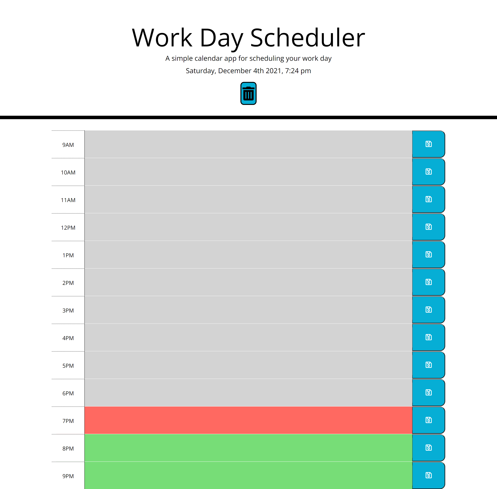

# Work-Day-Scheduler
# Description
For this week challenge, We were given the starter code. For this challenge, We had to use Third-Party APIs such as Bootstrap, Moment.js and jQuery. We had to create the JavaScript using jquery and Monment.js. The css file was already created. It only needs to be added into the html class selector for the timeblock section.       

### What It should do
The Work-Day Scheduler website is a daily planner that users can use to type events on a certain time of the current day and save the event on the page. Even when the page is refreshed the event should still be on the page.

I added a trash icon on the top that when clicked it would delete any events that on the planner. 


 

### Problem I had..
I had a problem with moment.js at the beginning of the JavaScript. The moment() was not recognize. It would not display the date and time on the page. I had to serach the web for a solution then I found a solution on stack overflow as to why the date and time was not displaying on the page. 

```html
var date = moment().format('dddd, MMMM Do YYYY, h:mm a');
    $('#currentDay').text(date);
```
The problem was on the html file, I had the script.js on top of the moment.js. Once I moved the script.js to the bottom, moment.js was executed.

```html
<script src="Develop/script.js"></script>
<script src="https://code.jquery.com/jquery-3.4.1.min.js"></script>
<script src="https://cdnjs.cloudflare.com/ajax/libs/moment.js/2.24.0/moment.min.js"></script>
   
```
## User Story
```
AS AN employee with a busy schedule
I WANT to add important events to a daily planner
SO THAT I can manage my time effectively
```
## Acceptance Criteria
```
GIVEN I am using a daily planner to create a schedule
WHEN I open the planner
THEN the current day is displayed at the top of the calendar
WHEN I scroll down
THEN I am presented with time blocks for standard business hours
WHEN I view the time blocks for that day
THEN each time block is color-coded to indicate whether it is in the past, present, or future
WHEN I click into a time block
THEN I can enter an event
WHEN I click the save button for that time block
THEN the text for that event is saved in local storage
WHEN I refresh the page
THEN the saved events persist
```